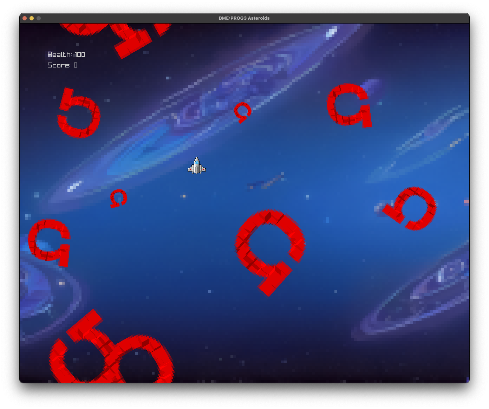

# PROG3 Lab 01
Autor: Prof. Dr.-Ing. Enrico Schröder - enrico.schroeder@th-nuernberg.de

**Willkommen zur ersten Übung zur Veranstaltung PROG3 / Teil B!**

### Übersicht
Im Laufe des Semesters werden Sie ein kleines Spiel in C++ schreiben (als Beispiel dient *Asteroids* - Sie können jedoch auch ein anderes Spiel entwickeln) und dabei die wichtigsten Konzepte von Objektorientiertem Programmieren und C++ praktisch kennenlernen und anwenden.



Wir fangen jedoch langsam an. In diesem ersten Lab sollen Sie sich mit der Entwicklungsumgebung und den dazugehörigen Tools vertraut machen. Sie werden ihr erstes simples C++ Programm schreiben und (manuell) kompilieren. Als nächstes werden Sie mithilfe von [raylib](https://www.raylib.com) bzw. [raylib-cpp](https://github.com/RobLoach/raylib-cpp) Ihr erstes graphisches Programm in C++ schreiben, welches Ihren Spiel-Hintergrund anzeigt. Am Ende werden Sie sich Gedanken machen, welche logische Architektur ihr Spiel benötigt und diese als C++ Klassen implementieren.


### Vorraussetzungen
Die Übungen sind so konzipiert, dass sie prinzipiell auf jedem System bearbeitet werden können. Es wird jedoch **wärmstens** empfohlen, Linux oder macOS zu verwenden. Nutzen Sie ggf. als Windows-Nutzer die virtuelle Maschine aus vorigen Veranstaltungen. 

Als Entwicklungsumgebung kommt [Visual Studio Code (vscode)](https://code.visualstudio.com) zum Einsatz. Stellen Sie sicher, dass Sie vscode auf Ihrem System installiert haben und ausführen können. Alle weiteren benötigten Programme installieren wir im Laufe der einzelnen Aufgaben.

### Abgaben
Um eine Übung erfolgreich zu bestehen, fertigen Sie ein Protokoll an und geben es (möglichst zeitnah) ab. In den einzelnen Aufgaben ist genauer genannt, was ins Protokoll hinein muss. Generell sollen Sie jedoch folgendes dokumentieren:
* Was haben Sie gelernt?
* Was hat funktioniert?
* Was hat nicht funktioniert?
* Was haben Sie probiert?

# Aufgabe 00
Schreiben und kompilieren Sie ihr erstes C++ Programm, das einfach "Hello Media Engineers" auf der Konsole ausgibt.  

#### Aufgabe 00_a
Stellen Sie sicher, dass sie über einen installierten C++ Compiler (üblicherweise *gcc* bzw. *g++* auf Linux bzw. *clang* auf macOS) verfügen. Sie sollten bereits über eine funktionierende Installation aus vorhergehenden Lehrveranstaltungen verfügen...
####  Aufabe 00_b
Im Ordner `00_HelloMediaEngineers` finden Sie eine leere C++ Datei *main.cpp*. Implementieren Sie, analog zur Vorlesung, ein simples Programm, das "Hello Media Engineers" auf der Konsole ausgibt.

Kompilieren Sie dieses Programm **über die Konsole** und führen Sie es aus! Notieren Sie die benötigten Schritte im Protokoll.

Hinweis: Sie können natürlich schon in diesem Schritt vscode als Editor verwenden. Kompilieren Sie es aber bitte nicht mit dem "Play" Knopf, sondern über die Konsole (Sie können in vscode über "Terminal->New Terminal" eine in Ihrem Projekt öffnen).

# Aufgabe 01
Schreiben und kompilieren Sie ein C++ Programm, welches ein graphisches Fenster öffnet und dort den Hintergrund Ihres Spiels anzeigt.

Hierfür sind ein paar weitere Schritte nötig. Wir verwenden [raylib](https://www.raylib.com) bzw. [raylib-cpp](https://github.com/RobLoach/raylib-cpp) für Grafikausgabe. Dies ist eine s.g. *Dependency (Abhängigkeit)*, d.h. ein externes Codemodul, welches wir in unser Projekt inkludieren müssen. Vielleicht ist Ihnen das aus anderen Sprachen wie z.B. *Java (packages)* oder *Python (modules)* bereits bekannt. Da C++ eine kompilierte Sprache ist, gestaltet sich der Umgang mit externen Abhängigkeiten etwas komplizierter. Aber keine Angst, auch hier verwenden wir ein Tool, das uns das Leben einfacher macht: [Cmake](https://cmake.org). Wenn ales richtig funktioniert, lädt Cmake raylib herunter und integriert es in Ihr Projekt.

Wir werden nun Schritt für Schritt die letzten benötigten Tools installieren... 

#### Aufgabe 01_a
Stellen Sie sicher, dass Sie Cmake auf Ihrem System installiert haben.

Die Installation hängt von Ihrem System ab. Sollen Sie Linux verwenden, sollte es beide Programme über den Paketmanager Ihrer Linuxdistribution geben (`sudo apt install cmake`). Ansonsten hier der Link auf die offiziellen Dokumentation: https://cmake.org/download

#### Aufgabe 01_b
Im Ordner ```01_Asteroids``` finden Sie das Gerüst für ihr zukünftiges Spiel! 
Stellen Sie sicher, dass Sie diese (noch leere) Gerüst, welches *raylib* als Abhängigkeit verwendet, mittels Cmake kompilieren können. 

Laden Sie dazu als erstes die vscode-Erweiterung [C/C++ Extension Pack](https://marketplace.visualstudio.com/items?itemName=ms-vscode.cpptools-extension-pack) herunter.

Linux-Nutzer (Ubuntu) müssen in diesem Schritt noch ein paar fehlende Pakete installieren:
`sudo apt install libasound2-dev libx11-dev libxrandr-dev libxi-dev libgl1-mesa-dev libglu1-mesa-dev libxcursor-dev libxinerama-dev`

TODO

#### Aufgabe 01_c
Nutzen Sie raylib-cpp, um ein leeres Fenster mit dem Hintergrundbild Ihres Spiels anzuzeigen.

Finden Sie heraus, wie das geht, indem Sie die Dokumentation von raylib-cpp konsultieren: https://github.com/RobLoach/raylib-cpp

Erweitern Sie die Datei ```01_Asteroids/src/main.cpp``` um die entsprechenden Funktionsaufrufe, sodass das Programm in etwa so aussieht:


Notieren Sie die wichtigsten Zeilen Ihres Programms im Protokoll!

Ein kleiner Hinweis zu raylib: Dies ist eigentlich eine C-Bibliothek. Wir verwenden aber die Sprache C++ und wollen objektorierten Code schreiben. Daher nutzen wir *raylib-cpp*, s.g. *C++ Bindings*. Diese machen die C Bibliothek nativ aus C++ heraus nutzbar (mit Klassen und Vererbung und allem drum und dran). Die Dokumentation von raylib-cpp ist nicht vollständig (da sie ja nur die Funktionen von raylib etwas "schöner" in C++ macht und man doppelte Dokumentation unbedingt vermeiden will). Sie werden daher im Laufe der Übungen öfters die Dokumentation von der Standardversion von raylib nutzen und selbständig die entsprechenden C++ Funktionsaufrufe herausfinden müssen (das ist aber meist sehr einfach!). 

# Aufgabe 02
Im Zentrum von objektorientierter Programmierung steht das *Objekt*, welches logisch zusammenhängende Daten, Zustände und Funktionalität kapselt. Überlegen Sie, welche *Objekte* es in Ihrem Spiel geben könnte und was diese tun bzw. welche Daten sie verwalten. 

Notieren Sie dies in Ihrem Protokoll!

Implementieren Sie ein oder zwei der wichtigsten Objekte als C++-Klassen mit dazugehörigen Daten und Methoden. Schreiben Sie Ihre main.cpp Datei so um, dass dort Instanzen des/der Objekt(e) erstellt werden und ggf. Methoden sinnvoll aufgerufen werden, um sie z.B. im Spielefenster anzuzeigen. 

Fügen Sie die wichtigsten Code-Schnipsel in ihr Protokoll hinzu!